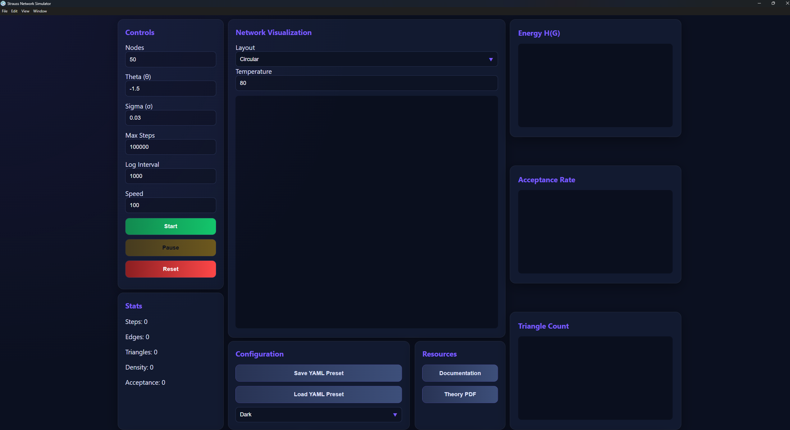

# Strauss Network Simulator

## Description
Strauss Network Simulator is a standalone desktop application designed for simulating Strauss random networks. The simulation is based on a Monte Carlo algorithm, enabling the generation and evolution of networks according to the Strauss random graph model.

The application provides users with a set of tools for exploring and analyzing the properties and behavior of simulated networks, including their structural characteristics, evolution, statistical properties, and other relevant network features.

## Preview
The UI of Strauss Network Simulator App:


## Usage

Using Strauss Network Simulator is straightforward and does not require any external software or programming environment.

1. **Launch the application**

   Start the application on your operating system. The simulator will open with the default simulation parameters.

2. **Configure the simulation**

   Set the desired simulation parameters, including:

   - **Nodes** – the number of nodes in the network.
   - **Theta (θ)** – a model parameter influencing the network's energy.
   - **Sigma (σ)** – a parameter controlling the behavior of the Strauss model.
   - **Max Steps** – the maximum number of Monte Carlo simulation steps.
   - **Log Interval** – the interval at which simulation data is recorded.
   - **Speed** – the speed of the simulation.
   - **Force Temperature** – the temperature parameter used by the force-directed visualization.

   Alternatively, a previously saved configuration can be loaded from a YAML file using the **Load YAML Preset** option. Example configurations are available in the `configs` directory included with the application.

3. **Select a visualization method**

   Choose one of the available network layouts:

   - **Circular** – nodes are arranged around a circle.
   - **Force Directed** – nodes are positioned using a force-directed layout algorithm.

4. **Start the simulation**

   Click the **Start** button to begin the Monte Carlo simulation. The application will visualize the evolving network and update the available statistics and analytical charts during the simulation.

5. **Analyze the network**

   During and after the simulation, the application provides several tools for examining the structural properties and behavior of the generated network, including network statistics, energy evolution, acceptance rate, triangle count, density, degree distribution, and equilibrium detection.

6. **Perform a hysteresis test**

   The application also provides a **Hysteresis Test** tool. By varying the value of the selected parameter over a specified range, users can observe the behavior of the network and investigate possible phase transitions and hysteresis effects.

7. **Save a configuration**

   The currently selected simulation parameters can be saved as a YAML configuration file using the **Save YAML Preset** option. Saved configurations can later be loaded and reused.

8. **Learn about the theoretical background**

   Click the **Theory PDF** button in the **Resources** section to open the included presentation describing the theoretical background of the Strauss random graph model.

9. **Access technical documentation**

   Click the **Documentation** button to access the technical documentation of the application.

## Visualisation

Strauss Network Simulator provides two methods for visualising the simulated network. The selected visualisation method affects only the graphical representation of the network and does not influence the underlying Monte Carlo simulation.

### Circular

The **Circular** layout provides a simple and deterministic method of visualising the network. As the name suggests, all nodes are positioned evenly around the circumference of a circle, while edges are drawn between connected nodes.

Because the positions of the nodes remain fixed, this layout provides a stable representation of the network throughout the simulation. It is particularly useful for observing changes in connectivity and the formation or removal of edges without the additional movement introduced by dynamic layout algorithms.

### Force Directed

The **Force Directed** layout uses the **Fruchterman-Reingold algorithm**, a force-based graph drawing algorithm designed to produce visually meaningful representations of network structures.

The algorithm models the network as a physical system in which nodes interact through simulated forces. Connected nodes are attracted towards each other, while all nodes repel one another. The repulsive interaction is conceptually similar to Coulomb-like forces, preventing nodes from collapsing into the same position and helping distribute them throughout the available space.

At the same time, edges act as attractive interactions between connected nodes, pulling related nodes closer together. The balance between attractive and repulsive forces causes the network to gradually reorganise itself into a configuration where highly connected nodes and clusters can become easier to identify.

The layout is calculated iteratively. During each iteration, the algorithm evaluates the forces acting on individual nodes and updates their positions accordingly. As the system evolves, the movement of nodes is gradually constrained to prevent excessive oscillations and to allow the layout to stabilise.

The **Temperature** parameter acts as a global constraint on node movement. It limits the maximum displacement that nodes can undergo during the layout calculation. A higher temperature allows nodes to move more freely and produce a more dynamic layout, while a lower temperature restricts movement and results in a more stable configuration.

The Force Directed layout can therefore provide a more intuitive representation of the network structure and may make features such as clusters, densely connected regions, and structural relationships easier to observe.


## Analysis Tools

Strauss Network Simulator provides a set of real-time visualisation and analysis tools that allow users to monitor the evolving properties and behaviour of a Strauss network throughout the Monte Carlo simulation.

- **Network Visualisation** – Displays the current state of the simulated network using either the **Circular** or **Force Directed** layout, allowing the user to observe changes in network connectivity and structure.

- **Energy H(G)** – Displays the evolution of the network energy as a function of the number of Monte Carlo simulation steps.

- **Acceptance Rate** – Shows the acceptance rate of proposed Monte Carlo moves over the course of the simulation.

- **Triangle Count** – Displays the number of triangles present in the network as a function of the number of Monte Carlo simulation steps.

- **Density vs Steps** – Tracks changes in network density throughout the simulation and displays the relationship between network density and the number of Monte Carlo steps.

- **Degree Distribution** – Presents the distribution of node degrees in the form of a histogram, allowing the user to examine how connections are distributed among the nodes.

- **Equilibrium Detector** – Monitors the evolution of selected network properties over Monte Carlo simulation steps in order to help identify whether the network has reached an equilibrium state.

- **Hysteresis Loop** – Visualises the results of a hysteresis test performed by varying the Sigma (σ) parameter, allowing the user to observe possible phase transitions and hysteresis effects in the network.

## Features
- Interactive Strauss network simulation
- Real-time network visualization
- Circular and force-directed layouts
- Energy and acceptance rate charts
- Triangle count analysis
- Density analysis
- Degree distribution
- Equilibrium detection
- Hysteresis testing
- YAML configuration presets
- Multiple visual themes
- Built-in Theory PDF

## Installation

Strauss Network Simulator is available for Windows, Linux, and macOS. The application is distributed as a standalone package and does not require Python, Node.js, or any other external runtime to be installed.

### Windows

Download the Windows installer from the following link:

[Download Strauss Network Simulator for Windows](https://github.com/JohnWhite-CodeSpace/Strauss/releases/download/v1.0.0/Strauss.Network.Simulator.Setup.1.0.0.exe)

Run the downloaded `.exe` installer and follow the installation wizard. The installer allows you to select the installation directory and optionally creates desktop and Start Menu shortcuts.

### Linux

Download the Linux version from the following link:

[Download Strauss Network Simulator for Linux](https://github.com/JohnWhite-CodeSpace/Strauss/releases/download/v1.0.0/Strauss.Network.Simulator-1.0.0.AppImage)

The Linux version is distributed as an `.AppImage` file. After downloading it, make the file executable:

```bash
chmod +x Strauss*.AppImage
```
Then start the application:
```
./Strauss*.AppImage
```
### macOS
Download the macOS version from the following link:
[Download Strauss Network Simulator for macOS](https://github.com/JohnWhite-CodeSpace/Strauss/releases/download/v1.0.0/Strauss.Network.Simulator-1.0.0-arm64.dmg)

The macOS version is distributed as a .dmg file. Open the downloaded disk image and drag Strauss Network Simulator into the Applications folder.

## Used Technologies

### Lenguages
- JavaScript (Frontend)
- Python (Backend)
- HTML/CSS (UI layout)

### App Builder Tools
- Electron
- PyInstaller
- Github Actions

## Credits
Author: Jan Biały